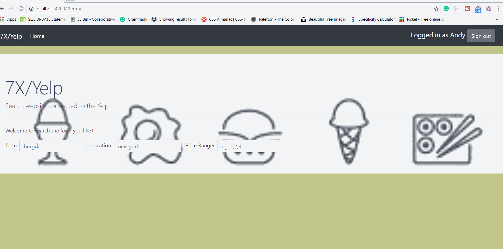

# 7X/Yelp

Author: Zhongcai Jiang

In this project, It include the yelp API and have function of search

## Time spent
Describe the time you spent on the project.
 * Tutorials, research: 4 hours
 * Coding required stories: 10 hours
 * Optional and extras: 2 hour

## User stories

### Required
 * [x] Search capability with at least three facets (e.g. name, category, location, price level, etc) 
 * [x] Search should show some form of “auto-complete” as the user is typing.
 * [x] Display detailed business information, such as:(e.g. Phone, Review Count and details, Hours)

### Optional

 * [x] Show location in Google Maps

## GIF Walkthrough

## Notes & shoutouts
In this lab, I have to spent time on setting the multiple search, and effert the final search. Also, I finally connect the google map to the project.
